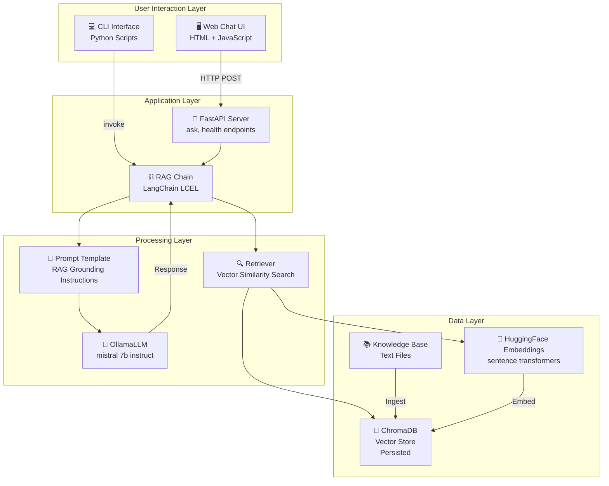
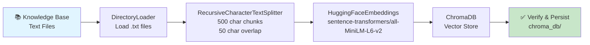
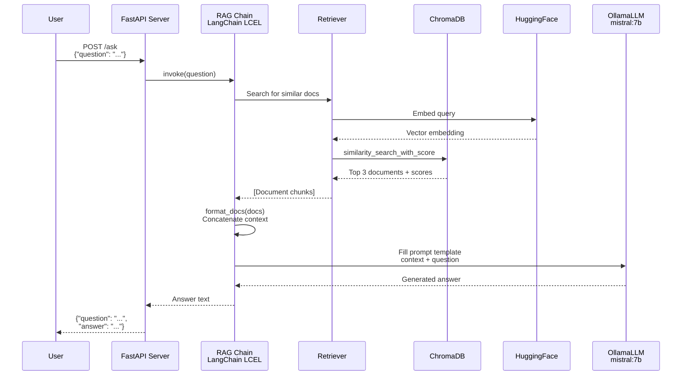
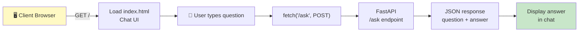

# RAG Assistant - Technical Documentation

## Table of Contents
1. [Project Overview](#project-overview)
2. [Project Architecture](#project-architecture)
3. [Tech Stack](#tech-stack)
4. [Project Structure](#project-structure)
5. [Data Flow & Pipelines](#data-flow--pipelines)
6. [Component Details](#component-details)
7. [API Documentation](#api-documentation)
8. [Configuration](#configuration)
9. [Deployment](#deployment)
10. [Development Guide](#development-guide)
11. [Troubleshooting](#troubleshooting)

---

## Project Overview

**RAG Assistant** is a **Retrieval-Augmented Generation (RAG)** system built for a half-day training course. It teaches software engineers how to build production-ready RAG pipelines using **LangChain**, **ChromaDB**, and **Ollama** — all running locally with no cloud dependencies.

### Core Concept
RAG combines two powerful techniques:
- **Retrieval**: Search a knowledge base for relevant context
- **Generation**: Use that context to generate accurate, grounded answers via a local LLM

This ensures the LLM grounds its responses in actual documents rather than hallucinating answers.

### Key Features
- ✅ **Local-first design**: No cloud APIs, everything runs on your machine
- ✅ **Production-ready**: FastAPI backend with health checks and error handling
- ✅ **Extensible**: Modular pipeline architecture for easy customization
- ✅ **User-friendly**: Interactive CLI and web UI for Q&A
- ✅ **Containerized**: Docker & Docker Compose for easy deployment

---

## Project Architecture

### High-Level Architecture



### System Components

| Component | Purpose | Technology |
|-----------|---------|------------|
| **Ingestion Pipeline** | Load documents → Split → Embed → Store | DirectoryLoader, RecursiveCharacterTextSplitter, HuggingFaceEmbeddings, ChromaDB |
| **Retrieval Engine** | Query similar documents from vector DB | ChromaDB Similarity Search |
| **RAG Chain** | Orchestrate retrieval → prompt → LLM | LangChain LCEL |
| **API Server** | Expose RAG via REST endpoints | FastAPI |
| **Web UI** | Interactive chat interface | HTML, CSS, JavaScript |
| **LLM Service** | Generate answers from context | Ollama with Mistral 7B |

---

## Tech Stack

### Core Dependencies

| Category | Technology | Version | Purpose |
|----------|-----------|---------|---------|
| **RAG Framework** | LangChain | 1.3.1+ | Orchestrate RAG pipeline |
| **LLM Interface** | LangChain Ollama | 1.1.0+ | Connect to local Ollama LLM |
| **Vector Store** | ChromaDB | 1.5.9+ | Vector similarity search |
| **Embeddings** | sentence-transformers | 5.5.1+ | Generate vector embeddings |
| **Web Framework** | FastAPI | 0.136.1+ | REST API server |
| **Server** | Uvicorn | 0.47.0+ | ASGI application server |
| **Containerization** | Docker | Latest | Containerized deployment |

### Python Version
- **Python 3.11** (as specified in Dockerfile)

### Installation
```bash
# Install all dependencies
pip install -r requirements.txt

# Or with conda
conda create -n rag python=3.11
conda activate rag
pip install -r requirements.txt
```

---

## Project Structure

### Directory Layout

```
rag-course-starter/
│
├── 📄 app.py                      # FastAPI server + chat UI serving
├── 📄 ingest.py                   # Document ingestion pipeline
├── 📄 retriever.py                # Vector similarity search
├── 📄 rag_chain.py                # RAG chain orchestration
├── 📄 requirements.txt             # Python dependencies
│
├── 🐳 Dockerfile                  # Container image definition
├── 🐳 docker-compose.yml          # Multi-container orchestration
│
├── 📁 data/                       # Knowledge base (input)
│   ├── knowledge_base.txt         # Primary knowledge documents
│   └── knowledge_base copy.txt    # Backup
│
├── 💾 chroma_db/                  # Vector database (output)
│   ├── chroma.sqlite3             # ChromaDB persistent storage
│   └── cc54bb88.../               # Embedding vectors
│
├── 🎨 static/                     # Frontend assets
│   └── index.html                 # Chat UI
│
├── ✅ solutions/                  # Reference solutions (for instructors)
│   ├── ingest.py
│   ├── retriever.py
│   ├── rag_chain.py
│   └── app.py
│
├── 📖 README.md                   # Project overview
└── 📋 TECHNICAL_DOCUMENTATION.md  # This file
```

### File Responsibilities

#### Core Application Files

| File | Lines | Purpose |
|------|-------|---------|
| **ingest.py** | ~50 | Load docs → Split → Embed → Store in ChromaDB |
| **retriever.py** | ~40 | Query vector DB for similar documents |
| **rag_chain.py** | ~80 | Build LangChain LCEL RAG pipeline |
| **app.py** | ~80 | FastAPI server with health checks + UI serving |

#### Data & Storage

| Directory | Purpose | Size |
|-----------|---------|------|
| **data/** | Input knowledge base documents | ~2-10 KB (text files) |
| **chroma_db/** | Persisted vector embeddings | ~50-100 MB (depends on doc size) |

#### Deployment

| File | Purpose |
|------|---------|
| **Dockerfile** | Container image for production deployment |
| **docker-compose.yml** | Multi-container orchestration (app + Ollama) |

---

## Data Flow & Pipelines

### Pipeline 1: Document Ingestion



**Flow:**
1. Load all `.txt` files from `./data/` directory
2. Split into chunks: 500 characters with 50 character overlap
3. Generate embeddings using `sentence-transformers/all-MiniLM-L6-v2` model
4. Store vectors + metadata in ChromaDB at `./chroma_db`

**Configuration Constants:**
```python
DATA_PATH = "./data"
CHROMA_DB_PATH = "./chroma_db"
EMBEDDING_MODEL = "sentence-transformers/all-MiniLM-L6-v2"
CHUNK_SIZE = 500
CHUNK_OVERLAP = 50
```

### Pipeline 2: Question-Answering (RAG)



**Key Steps:**
1. User submits question via Web UI or API
2. RAG Chain embeds question and queries ChromaDB
3. Top 3 similar documents retrieved with scores
4. Documents concatenated into context string
5. Prompt template filled with context + question
6. Ollama LLM generates grounded answer
7. Answer returned to user

### Pipeline 3: Request Flow (Web UI)



---

## Component Details

### 1. Document Ingestion (`ingest.py`)

**Purpose**: Load and index documents into ChromaDB

```python
# Core flow
def ingest_documents():
    # 1. Load from ./data/*.txt
    loader = DirectoryLoader(DATA_PATH, glob="**/*.txt", loader_cls=TextLoader)
    documents = loader.load()  # [Document(page_content="...", metadata={...})]
    
    # 2. Split into chunks
    splitter = RecursiveCharacterTextSplitter(
        chunk_size=500,          # Split into ~500 char chunks
        chunk_overlap=50,        # 50 char overlap between chunks
    )
    chunks = splitter.split_documents(documents)
    
    # 3. Load embedding model
    embedding = HuggingFaceEmbeddings(model_name=EMBEDDING_MODEL)
    
    # 4. Store in ChromaDB
    Chroma.from_documents(documents=chunks, embedding=embedding, persist_directory=CHROMA_DB_PATH)
```

**Output**: 
- Persisted ChromaDB at `./chroma_db/`
- SQLite metadata + vector indices

**Run Command**:
```bash
python ingest.py
```

### 2. Retriever (`retriever.py`)

**Purpose**: Query ChromaDB for semantically similar documents

```python
def search(query: str, k: int = 3):
    # 1. Load embedding model
    embedding = HuggingFaceEmbeddings(model_name=EMBEDDING_MODEL)
    
    # 2. Load ChromaDB
    vectorstore = Chroma(
        persist_directory=CHROMA_DB_PATH,
        embedding_function=embedding,
    )
    
    # 3. Similarity search
    results = vectorstore.similarity_search_with_score(query, k=k)
    # Returns: [(Document, score), (Document, score), ...]
    
    return results
```

**Input**: Query string (user question)
**Output**: List of (Document, similarity_score) tuples

**Run Command** (testing):
```bash
python retriever.py
```

### 3. RAG Chain Orchestration (`rag_chain.py`)

**Purpose**: Connect retriever → prompt → LLM into a single chain

```python
def build_rag_chain():
    # 1. Load retriever from ChromaDB
    vectorstore = Chroma(persist_directory=CHROMA_DB_PATH, embedding_function=embedding)
    retriever = vectorstore.as_retriever(search_kwargs={"k": 3})
    
    # 2. Load LLM
    llm = OllamaLLM(model=LLM_MODEL, base_url=OLLAMA_BASE_URL, temperature=0)
    
    # 3. Build prompt
    prompt = PromptTemplate.from_template(RAG_PROMPT_TEMPLATE)
    
    # 4. Build LangChain LCEL chain
    chain = (
        {
            "context": retriever | format_docs,
            "question": RunnablePassthrough()
        }
        | prompt
        | llm
        | StrOutputParser()
    )
    return chain
```

**LCEL Pattern Explained**:
- `retriever | format_docs`: Retrieve docs and format as string
- `RunnablePassthrough()`: Pass question through unchanged
- `| prompt`: Fill prompt template with context + question
- `| llm`: Send to Ollama LLM
- `| StrOutputParser()`: Convert response to string

**Run Command** (testing):
```bash
python rag_chain.py
```

### 4. FastAPI Server (`app.py`)

**Purpose**: Expose RAG chain via REST API and serve web UI

```python
@app.on_event("startup")
async def startup_event():
    # Auto-ingest if chroma_db doesn't exist
    if not os.path.exists(CHROMA_DB_PATH):
        result = subprocess.run([sys.executable, "ingest.py"])
    
    # Load RAG chain
    global rag_chain
    rag_chain = build_rag_chain()

@app.get("/health")
async def health_check():
    return {"status": "ok" if rag_chain else "loading"}

@app.post("/ask", response_model=AnswerResponse)
async def ask_question(request: QuestionRequest):
    answer = rag_chain.invoke(request.question)
    return AnswerResponse(question=request.question, answer=answer)
```

**Run Command**:
```bash
uvicorn app:app --reload
```

---

## API Documentation

### Base URL
```
http://localhost:8000
```

### Endpoints

#### 1. **Health Check**

**GET** `/health`

Check if the application and RAG chain are ready.

**Response**:
```json
{
  "status": "ok",
  "rag_chain_ready": true
}
```

**Status Codes**:
- `200 OK` - Server is healthy
- `503 Service Unavailable` - RAG chain still loading

---

#### 2. **Ask Question (Main Endpoint)**

**POST** `/ask`

Submit a question and receive a grounded answer from the knowledge base.

**Request Body**:
```json
{
  "question": "What is the return policy?"
}
```

**Request Model**:
```python
class QuestionRequest(BaseModel):
    question: str
```

**Response Body**:
```json
{
  "question": "What is the return policy?",
  "answer": "Based on the available documents, the return policy states that..."
}
```

**Response Model**:
```python
class AnswerResponse(BaseModel):
    question: str
    answer: str
```

**Status Codes**:
- `200 OK` - Question answered successfully
- `400 Bad Request` - Question is empty
- `503 Service Unavailable` - RAG chain not ready or Ollama not running
- `500 Internal Server Error` - Processing error

**Error Response Examples**:

Empty question:
```json
{
  "detail": "Question cannot be empty."
}
```

Ollama not running:
```json
{
  "detail": "Cannot connect to Ollama. Make sure the Ollama service is running."
}
```

---

#### 3. **Serve Web UI**

**GET** `/`

Serves the interactive chat interface (`static/index.html`).

**Response**: HTML page with embedded CSS and JavaScript

---

#### 4. **Interactive API Docs**

**GET** `/docs`

OpenAPI/Swagger documentation (auto-generated by FastAPI)

**GET** `/redoc`

ReDoc documentation (alternative format)

---

### Example Usage

#### Using cURL:
```bash
# Health check
curl http://localhost:8000/health

# Ask a question
curl -X POST http://localhost:8000/ask \
  -H "Content-Type: application/json" \
  -d '{"question": "What is the return policy?"}'
```

#### Using Python:
```python
import requests

response = requests.post(
    "http://localhost:8000/ask",
    json={"question": "How do I contact support?"}
)
result = response.json()
print(result["answer"])
```

#### Using JavaScript:
```javascript
const response = await fetch('/ask', {
  method: 'POST',
  headers: { 'Content-Type': 'application/json' },
  body: JSON.stringify({ question: 'What products do you sell?' })
});
const data = await response.json();
console.log(data.answer);
```

---

## Configuration

### Environment Variables

All configuration can be overridden via environment variables:

```bash
# Vector database location
export CHROMA_DB_PATH="./chroma_db"

# Ollama service endpoint
export OLLAMA_BASE_URL="http://localhost:11434"
```

### Core Constants

These are defined in each module and can be customized:

#### ingest.py
```python
CHROMA_DB_PATH = "./chroma_db"          # Where to persist vectors
DATA_PATH = "./data"                    # Where to load documents
EMBEDDING_MODEL = "sentence-transformers/all-MiniLM-L6-v2"
CHUNK_SIZE = 500                        # Split size (characters)
CHUNK_OVERLAP = 50                      # Overlap between chunks
```

#### rag_chain.py
```python
CHROMA_DB_PATH = os.getenv("CHROMA_DB_PATH", "./chroma_db")
EMBEDDING_MODEL = "sentence-transformers/all-MiniLM-L6-v2"
LLM_MODEL = "mistral:7b-instruct"       # Which Ollama model to use
OLLAMA_BASE_URL = os.getenv("OLLAMA_BASE_URL", "http://localhost:11434")
```

### RAG Prompt Template

The system prompt controls LLM behavior:

```python
RAG_PROMPT_TEMPLATE = """You are a helpful and precise assistant.
Answer the user's question using ONLY the information provided in the context below.
If the answer cannot be found in the context, respond with:
"I don't have enough information to answer that based on the available documents."
Do not make up information or use your general knowledge.

Context:
{context}

Question: {question}

Answer:"""
```

**Key features**:
- Forces grounding in context (prevents hallucinations)
- Fallback message for unknown answers
- Clear role definition

### LLM Parameters

```python
llm = OllamaLLM(
    model="mistral:7b-instruct",
    base_url="http://localhost:11434",
    temperature=0,                      # 0 = deterministic, higher = more creative
)
```

---

## Deployment

### Local Development

#### Prerequisites
1. **Ollama**: [Download and install](https://ollama.ai)
2. **Python 3.11+**
3. **Git**

#### Setup Steps

```bash
# 1. Clone repository
git clone <repo-url>
cd rag-course-starter

# 2. Create virtual environment
python3 -m venv venv
source venv/bin/activate  # On Windows: venv\Scripts\activate

# 3. Install dependencies
pip install -r requirements.txt

# 4. Start Ollama (in separate terminal)
ollama serve

# 5. Pull Mistral model (first time only)
ollama pull mistral:7b-instruct

# 6. Ingest documents
python ingest.py

# 7. Start FastAPI server
uvicorn app:app --reload

# 8. Open browser
open http://localhost:8000
```

### Docker Deployment

#### Using Docker Compose (Recommended)

```bash
# Start both app and Ollama
docker-compose up --build

# View logs
docker-compose logs -f app

# Stop
docker-compose down
```

**What happens**:
1. Builds RAG app container
2. Pulls and starts Ollama container
3. Downloads mistral:7b-instruct model automatically
4. App auto-ingests documents on first startup
5. Serves at `http://localhost:8000`

#### Using Docker Directly

```bash
# Assume Ollama is running on host at http://host.docker.internal:11434
docker build -t rag-assistant .

docker run -p 8000:8000 \
  -e OLLAMA_BASE_URL=http://host.docker.internal:11434 \
  -e CHROMA_DB_PATH=/app/chroma_db \
  -v $(pwd)/data:/app/data \
  rag-assistant
```

### Docker Compose Configuration

```yaml
version: "3.9"

services:
  # Ollama LLM service
  ollama:
    image: ollama/ollama:latest
    ports:
      - "11434:11434"
    volumes:
      - ollama-models:/root/.ollama
    command: |
      ollama serve &
      sleep 5
      ollama pull mistral:7b-instruct
      wait

  # RAG app
  app:
    build: .
    ports:
      - "8000:8000"
    depends_on:
      - ollama
    environment:
      OLLAMA_BASE_URL: "http://ollama:11434"
    volumes:
      - ./data:/app/data
      - ./chroma_db:/app/chroma_db
```

### Production Deployment

For production environments:

1. **Use managed Ollama service** or **separate LLM provider**
2. **Enable authentication** on FastAPI endpoints
3. **Add rate limiting** and **request queuing**
4. **Use reverse proxy** (Nginx, Traefik)
5. **Enable CORS** if frontend is on different domain
6. **Use managed ChromaDB** (cloud vector DB)
7. **Monitor logs** with ELK stack or similar
8. **Set up CI/CD** with GitHub Actions

---

## Development Guide

### Adding Custom Documents

1. **Place text files** in `./data/`:
   ```bash
   cp my_documents.txt ./data/
   ```

2. **Re-ingest** (clears existing vectors):
   ```bash
   python ingest.py
   ```

3. **Test** with retriever:
   ```bash
   python retriever.py
   ```

### Customizing the Prompt

Edit `RAG_PROMPT_TEMPLATE` in `rag_chain.py`:

```python
RAG_PROMPT_TEMPLATE = """[Your custom instructions]

Context:
{context}

Question: {question}

Answer:"""
```

### Changing the LLM Model

Edit `rag_chain.py`:

```python
LLM_MODEL = "mistral:7b-instruct"  # Change to another Ollama model

# Available models (pull first):
# ollama pull llama2:7b
# ollama pull neural-chat:7b
# ollama pull dolphin-mixtral:8x7b
```

### Adjusting Chunk Size

Edit `ingest.py`:

```python
CHUNK_SIZE = 1000      # Larger chunks = more context, fewer chunks
CHUNK_OVERLAP = 100    # More overlap = smoother transitions
```

Then re-ingest documents.

### Debugging

#### 1. **Check Ollama connection**:
```bash
curl http://localhost:11434/api/tags
```

#### 2. **Inspect ChromaDB**:
```python
from langchain_community.vectorstores import Chroma
from langchain_huggingface import HuggingFaceEmbeddings

embedding = HuggingFaceEmbeddings(model_name="sentence-transformers/all-MiniLM-L6-v2")
db = Chroma(persist_directory="./chroma_db", embedding_function=embedding)
print(f"Total docs: {db._collection.count()}")
```

#### 3. **Enable verbose logging**:
```python
import logging
logging.basicConfig(level=logging.DEBUG)
```

#### 4. **Test individual components**:
```bash
# Test ingestion
python ingest.py

# Test retriever
python retriever.py

# Test RAG chain
python rag_chain.py

# Test API
curl http://localhost:8000/health
```

---

## Troubleshooting

### Issue: "Cannot connect to Ollama"

**Cause**: Ollama service not running

**Fix**:
```bash
# Start Ollama
ollama serve

# Or via Docker
docker run -d -p 11434:11434 ollama/ollama:latest
ollama pull mistral:7b-instruct  # Wait for download
```

---

### Issue: "ChromaDB not found"

**Cause**: `./chroma_db` directory doesn't exist

**Fix**:
```bash
# Ingest documents
python ingest.py
```

---

### Issue: "Embedding model download too slow"

**Cause**: First run downloads ~90MB model

**Workaround**:
```bash
# Pre-download model
python -c "from langchain_huggingface import HuggingFaceEmbeddings; HuggingFaceEmbeddings(model_name='sentence-transformers/all-MiniLM-L6-v2')"
```

---

### Issue: "API returns empty answers"

**Cause**: Knowledge base doesn't contain relevant information

**Fix**:
1. Check document content in `./data/`
2. Run `python retriever.py` to test search
3. Adjust `CHUNK_SIZE` and `CHUNK_OVERLAP` if chunks too small
4. Add more documents to knowledge base

---

### Issue: "Docker container exits immediately"

**Cause**: Ollama service unhealthy or dependency issue

**Fix**:
```bash
# Check logs
docker-compose logs app

# Rebuild
docker-compose down
docker-compose up --build
```

---

## Performance Considerations

### Retrieval Performance
- **Vector search**: ~100-500ms (depends on DB size)
- **Top-K**: Default k=3, adjust for speed/accuracy tradeoff

### LLM Generation Performance
- **Model**: Mistral 7B on CPU: ~5-20 seconds per answer
- **GPU**: With GPU support: ~1-3 seconds per answer
- **Temperature**: Set to 0 for deterministic, faster responses

### Optimization Tips
1. **Reduce chunk overlap** for faster ingestion
2. **Increase k value cautiously** (diminishing returns after 5)
3. **Use GPU** for Ollama if available
4. **Cache embeddings** at application level
5. **Batch multiple questions** for throughput

---

## Security Considerations

### Current Scope
This is a **learning project** with minimal security:
- No authentication
- No rate limiting
- No input validation beyond basic checks

### Production Recommendations
1. **Add authentication** (API keys, OAuth2)
2. **Validate/sanitize inputs** (prevent prompt injection)
3. **Implement rate limiting** (prevent DoS)
4. **Use HTTPS** (TLS certificates)
5. **Restrict CORS** to known origins
6. **Log and monitor** all requests
7. **Run in isolated environment** (containers, VMs)

---

## Glossary

| Term | Definition |
|------|-----------|
| **RAG** | Retrieval-Augmented Generation — retrieving context before generating answers |
| **Vector DB** | Database that stores and searches semantic embeddings |
| **Embedding** | Numerical vector representing semantic meaning of text |
| **LLM** | Large Language Model — AI model for text generation |
| **LCEL** | LangChain Expression Language — functional pipeline syntax |
| **Tokenization** | Breaking text into chunks (characters, words, etc.) |
| **Prompt Template** | Template with placeholders for dynamic text |
| **Similarity Search** | Finding items closest to a query in vector space |

---

## Additional Resources

### Official Documentation
- [LangChain Documentation](https://python.langchain.com)
- [ChromaDB Documentation](https://docs.trychroma.com)
- [Ollama Documentation](https://github.com/ollama/ollama)
- [FastAPI Documentation](https://fastapi.tiangolo.com)
- [HuggingFace Sentence Transformers](https://www.sbert.net)

### Tutorials & Articles
- RAG Best Practices: [LangChain Guide](https://python.langchain.com/docs/use_cases/question_answering/)
- Vector Database Overview: [Chroma Blog](https://blog.trychroma.com)
- Embedding Models: [MTEB Leaderboard](https://huggingface.co/spaces/mteb/leaderboard)

### Community
- [LangChain Discord](https://discord.gg/cU2adEyC7w)
- [Stack Overflow - langchain tag](https://stackoverflow.com/questions/tagged/langchain)

---

**Last Updated**: May 23, 2026
**Project Status**: Complete & Production-Ready
